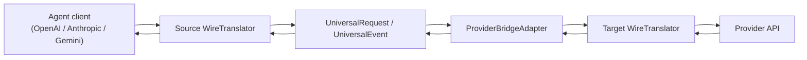

# Architecture and IR

This crate is built around a small protocol-neutral intermediate representation (IR). The IR is the stable center; wire protocols and providers are adapters around it.

## Layering

| Layer | Files | Notes |
| --- | --- | --- |
| Protocol IDs | `src/protocol.rs` | Defines `WireProtocol` identifiers used by routes, catalog entries, and translators. |
| Wire schema shells | `src/schema/` | Light serde types and provider catalog schema; raw payloads remain `serde_json::Value` friendly. |
| Universal IR | `src/universal/` | Protocol-neutral request/response/message/tool/reasoning model. |
| Stream IR | `src/stream.rs` | Protocol-neutral response lifecycle events. |
| Translators | `src/translator/` | Decode/encode protocol-specific request, response, and stream chunks. |
| Provider adapters | `src/providers/` | Provider-specific quirks that are not generic protocol translation. |
| SDK exports | `src/lib.rs` | Public re-export surface for host applications. |

## IR Principles

- Preserve semantic intent first: role, text, tool calls, tool results, reasoning, model, generation settings, and usage should survive round trips.
- Keep protocol-specific or unknown fields in `extensions` or `SourcePayload` instead of silently discarding them.
- Keep networking out of the IR. Credentials, headers, URLs, retries, and quota logic belong to the host.
- Prefer loss-aware conversion. If a target protocol cannot represent a field, keep enough source context for debugging or replay.
- Stream and non-stream responses should converge through the same `UniversalEvent` vocabulary.

## `UniversalRequest`

| Field | Meaning | Typical source mappings |
| --- | --- | --- |
| `id` | Optional host/request identifier. | OpenAI response IDs, host session metadata. |
| `model` | Requested model ID. | `model` in OpenAI/Anthropic; URL model segment or body model in Gemini flows. |
| `instructions` | System/developer instructions. | OpenAI `instructions`, `system`/`developer` messages, Anthropic `system`. |
| `input` | Ordered conversation items. | OpenAI `messages`/`input`, Anthropic `messages`, Gemini `contents`. |
| `tools` | Function/tool declarations. | OpenAI `tools`, Anthropic `tools`, Gemini `functionDeclarations`. |
| `tool_choice` | Tool selection policy. | OpenAI `tool_choice`, Anthropic `tool_choice`, Gemini `function_calling_config.mode`. |
| `stream` | Whether caller requested streaming. | `stream` boolean or host route semantics. |
| `generation` | Sampling and output limits. | `temperature`, `top_p`, `max_tokens`, `max_output_tokens`, `max_completion_tokens`. |
| `reasoning` | Reasoning effort/visibility/budget. | OpenAI `reasoning`, DeepSeek/MiMo `thinking`, Anthropic `thinking`, Gemini thinking config. |
| `source` | Original protocol and optional raw payload. | Used when lossless replay or provider repair needs source context. |
| `extensions` | Escape hatch for non-core fields. | Provider metadata, unsupported but preserved request fields. |

## `UniversalItem`

| Variant | Meaning | Protocol examples |
| --- | --- | --- |
| `Message` | A role-bearing message with content blocks. | OpenAI chat message, Anthropic message, Gemini content. |
| `ToolCall` | A model-requested function/tool call. | OpenAI `tool_calls`/Responses `function_call`, Anthropic `tool_use`, Gemini `functionCall`. |
| `ToolResult` | Host result for a prior tool call. | OpenAI `tool` message/function output, Anthropic `tool_result`, Gemini `functionResponse`. |
| `Reasoning` | Visible or encrypted reasoning content. | OpenAI Responses reasoning items, Anthropic thinking blocks, provider `reasoning_content`. |
| `Unknown` | Raw object that cannot be normalized yet. | Future protocol item types or provider-specific blocks. |

## `ContentBlock`

| Variant | Meaning | Notes |
| --- | --- | --- |
| `Text` | Plain text content. | Primary cross-protocol content type. |
| `Image` | URL/base64 image input. | Supported only where source and target protocols can represent it. |
| `File` | URL/base64/file-like input. | Kept separately from image to avoid lossy media coercion. |
| `ToolCall` | Tool call embedded inside message content. | Needed for Anthropic content blocks and some provider streams. |
| `ToolResult` | Tool result embedded inside message content. | Needed for Anthropic content blocks and Gemini function responses. |
| `Reasoning` | Reasoning text or encrypted reasoning token. | Used by Responses, Anthropic thinking, DeepSeek/MiMo replay. |
| `Unknown` | Raw content block. | Escape hatch for new modalities. |

## Stream Event Model

`UniversalEvent` describes response streaming independent of the source protocol:

| Event | Meaning |
| --- | --- |
| `ResponseStart` / `ResponseDone` | Whole-response lifecycle. |
| `MessageStart` / `MessageDone` | Assistant message lifecycle and finish reason. |
| `ContentStart` / `ContentDone` | Individual content block lifecycle. |
| `TextDelta` | Text token/content delta. |
| `ReasoningDelta` | Reasoning/thinking delta. |
| `ToolCallDelta` | Tool call ID/name/argument delta. |
| `Error` | Provider or translation error event. |
| `Unknown` | Raw stream event that is not normalized yet. |

`UniversalResponse::from_events` and `UniversalResponse::to_events` bridge non-stream and stream flows so translators can share behavior.

## Protocol Mapping

| Concept | OpenAI Responses | OpenAI Chat | Anthropic Messages | Gemini Generate Content |
| --- | --- | --- | --- | --- |
| User input | `input` item list or string | `messages[]` | `messages[]` | `contents[]` |
| Instructions | `instructions` | `system`/`developer` messages | top-level `system` | system instruction/config |
| Text | `message`/`output_text` | `message.content` | `content[].text` | `parts[].text` |
| Tool declaration | `tools[]` | `tools[]` | `tools[]` with `input_schema` | `tools[].functionDeclarations[]` |
| Tool call | `function_call` item | assistant `tool_calls[]` | `tool_use` block | `functionCall` part |
| Tool result | `function_call_output` item | `tool` role message | `tool_result` block | `functionResponse` part |
| Tool choice | `tool_choice` | `tool_choice` | `tool_choice` | `function_calling_config.mode` |
| Reasoning | `reasoning` items / encrypted content | provider extensions such as `reasoning_content` | `thinking` blocks | thinking config / thought signatures |
| Streaming | SSE response events | chat completion chunks | message/content block events | stream generateContent chunks |

## Provider Adapter Workflow

Provider adapters run after generic protocol translation and before/after provider transport:

1. Decode source request with the source `WireTranslator`.
2. Encode the IR request with the target `WireTranslator`.
3. Apply `ProviderBridgeAdapter::prepare_*_request` for target-provider quirks.
4. Host sends the request to the configured upstream.
5. Decode upstream response or stream chunks with the target translator.
6. Apply provider response/event transforms.
7. Encode events back into the source protocol for the agent.

Provider logic belongs in `src/providers/` when the behavior is tied to a vendor, not to a protocol. Examples:

- DeepSeek and MiMo require reasoning replay around tool history.
- DashScope rejects some forced-tool/thinking combinations.
- MiniMax emits `<think>` tags that should become reasoning events.
- Kimi coding can emit tagged tool-call sections that need structural normalization.
- xAI Responses rejects or ignores some OpenAI-specific request fields.

## Adding a Wire Protocol

1. Add a `WireProtocol` variant and string mapping.
2. Add permissive schema shells only where typed schema improves clarity.
3. Implement `WireTranslator` for request decode/encode, response decode, stream decode, and event encode.
4. Add round-trip tests for text, tools, tool results, reasoning, usage, and streaming.
5. Add documentation in this file and `docs/provider-integration-guide.md`.

## Adding a Provider Adapter

1. Confirm official provider protocol documentation and list supported paths.
2. Decide which parts are generic protocol translation versus provider quirks.
3. Add a provider adapter under `src/providers/`.
4. Wire it into `ProviderBridgeAdapter::for_provider`.
5. Add unit tests for request preparation, response normalization, and stream transforms.
6. Add live VibeAround coverage for direct protocol and cross-protocol tool turns.
7. Document setup requirements, unsupported fields, and observed failures.

## Module Size Guidelines

Keep translator/provider files small enough to review surgically:

- Split request, response, and stream logic when a translator grows beyond a few hundred lines.
- Move shared conversion helpers into `translator/common.rs` or provider submodules.
- Keep provider adapters focused on vendor quirks; do not add route selection, credentials, or HTTP code.
- Add tests next to the module whose behavior they pin down.
- Prefer explicit helper names over large nested `match` blocks.

These guidelines are already reflected in split modules such as `src/translator/openai_responses.rs`, `src/providers/deepseek/`, and `src/providers/minimax/`.
