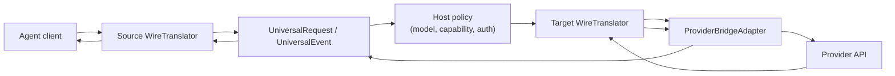

# Architecture

`va-ai-api-bridge` is organized around a protocol-neutral center. Wire protocols decode into IR, hosts can apply policy, and target protocols encode from IR. Provider adapters sit outside the generic protocol mapping and handle vendor-specific package quirks.

## Layers

| Layer | Files | Owns |
| --- | --- | --- |
| Protocol IDs | `src/protocol.rs` | Stable names for supported source/target wire protocols. |
| Wire schema shells | `src/schema/` | Light serde shells and provider catalog structs. |
| Universal IR | `src/universal/` | Protocol-neutral request, response, content, tools, reasoning, and usage. |
| Streaming IR | `src/stream.rs` | Protocol-neutral response lifecycle events and state. |
| Translators | `src/translator/` | Loss-aware decode/encode between wire payloads and IR. |
| Provider adapters | `src/providers/` | Provider-specific request/response/event transforms. |
| SDK exports | `src/lib.rs` | Public surface for embedding hosts. |

## Host Boundary

The host should own everything that requires external state:

- route shape and URL construction
- credentials, auth headers, OAuth tokens, and proxy settings
- profile/model selection and model capability policy
- upstream HTTP calls and retry behavior
- chat history, launch metadata, and session state
- SSE framing and connection lifecycle

The crate should own deterministic payload transforms:

- request decode and encode
- response decode and encode
- stream chunk decode and event encode
- provider package-shape repair
- unknown-field preservation where practical

## Translation Flow

A typical cross-protocol request flow is:

1. Decode the agent request with the source `WireTranslator`.
2. Apply host policy to the `UniversalRequest`, such as model mapping or media capability handling.
3. Encode the request with the target `WireTranslator`.
4. Apply `ProviderBridgeAdapter` request transforms for the selected provider.
5. Send the JSON body to the upstream provider.

The response flow reverses this process:

1. Decode upstream response or stream chunks with the target translator.
2. Apply provider event transforms where needed.
3. Encode events back to the source protocol.
4. Let the host frame and return the final HTTP/SSE response.
